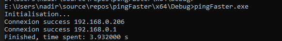
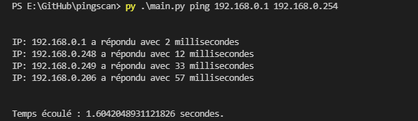

## Teste de refonte du code [du challenge CQSCMQPDI de novembre 2021](https://github.com/nadnone/CQSCMQPDI_11_2021) en ésperant que cela serait plus rapide.

### BUG:
- il semblerait que lorsque le programme commence à ping l'ip localhost, le programme affiche des succès de ping de toutes les Ips de la plage

### Problèmes:
- le programme est plus long que celui en python3 (je me demande pourquoi, je pense que c'est à cause du timeout)

## Credits:
- [This product includes software developed by the University of California, Berkeley and its contributors.](https://github.com/the-tcpdump-group/tcpdump/blob/e3a00d340c8707b178b0cce017e009cfaafdd22d/ip.h)